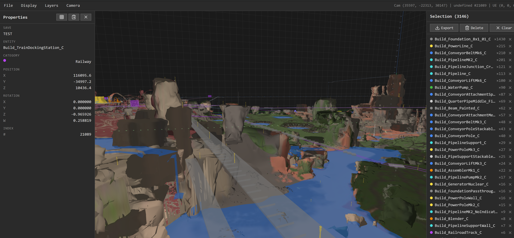
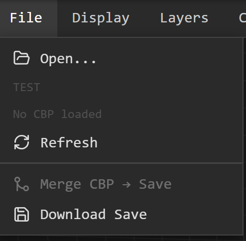
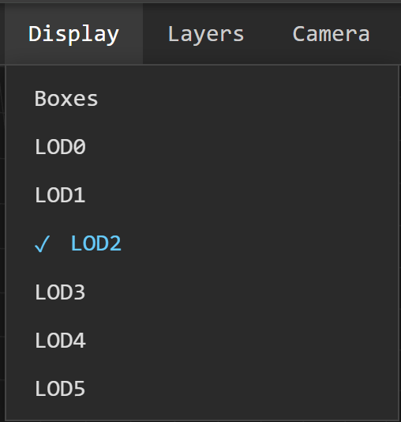
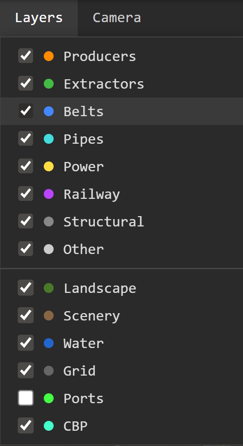
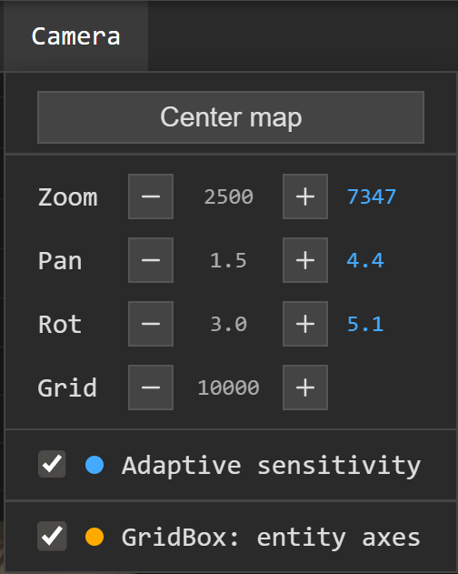
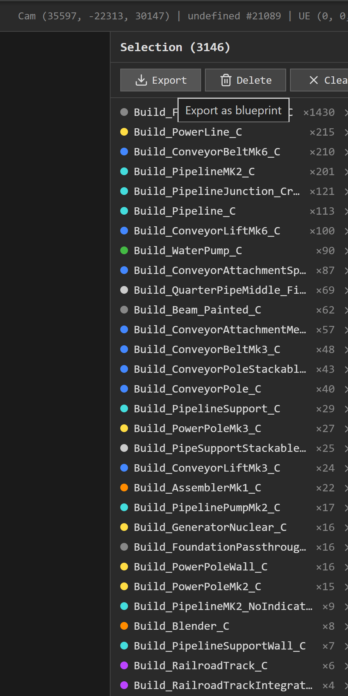

/planok# Satisfactory Toolkit

Node.js + C# toolkit for Satisfactory 1.0 save editing, blueprint manipulation, logistics optimization, 3D visualization, and game asset extraction.

## Features

- **3D Entity Viewer** - Three.js browser-based viewer with terrain, scenery meshes, water, and entity rendering
- **Asset Extractor (pak-tool)** - C# tool to extract meshes, textures, terrain, water, and actor placements from game `.pak` files
- **Save Editing** - Programmatic building creation (belts, pipes, producers, foundations, railways...)
- **Blueprint System** - Export/import blueprints, place them interactively in the viewer
- **Sink Points Optimizer** - LP solver (HiGHS) to maximize sink points/min with power/resource constraints
- **Entity Operations** - Select, inspect, delete, and export entities from the viewer



## Quick Start

```bash
# Install dependencies
npm install

# Launch the 3D viewer
node viewer/server.js
# Open http://localhost:3000
```

Drop a `.sav`, `.cbp`, or `.sbp` file into the viewer to visualize it.

## 3D Entity Viewer

### Controls

| Action | Control |
|--------|---------|
| Rotate camera | Left click + drag |
| Inspect entity | Left click |
| Select entity | Ctrl + click |
| Box select | Shift + drag |
| Pan | Right click + drag |
| Close properties | Right click |
| Zoom | Mouse wheel |

### Blueprint Placement

Load a `.sbp` file to enter placement mode:

| Key | Action |
|-----|--------|
| Q / D | Move X |
| Z / S | Move Y |
| R / F | Move Z |
| A / E | Rotate |
| Enter | Inject into save |
| Escape | Cancel |

Hold **Shift** for fine movement (10u / 1deg), **Ctrl** for grid snap (800u / 90deg).

### Menus

| File | Display | Layers | Camera |
|:----:|:-------:|:------:|:------:|
|  |  |  |  |
| Open, Refresh, Merge CBP, Download Save | Rendering mode: Boxes or LOD level (0-5) | Toggle entity categories, terrain, scenery, water, grid, ports, CBP | Zoom/Pan/Rot sensitivity, adaptive mode, grid spacing, GridBox |

### Selection Panel



Export selection as blueprint, delete entities, grouped class list with counts and color-coded categories.

## Asset Extractor (pak-tool)

C# (.NET 8) tool using CUE4Parse to extract assets from Satisfactory `.pak` files.

```bash
cd tools/pak-tool

# Explore exports by regex
dotnet run -- list-exports --regexp "smelter" --limit 10

# Deep dump with JSONPath filtering
dotnet run -- export-details --regexp "BP_River.*::SplineComponent" --jsonpath "$..SplineCurves"

# Export building meshes (GLB)
dotnet run -- export buildings -p 8

# Export terrain tiles
dotnet run -- export landscape -p 8 --ratio 0.15

# Export water placements + river splines
dotnet run -- export water
```

## Project Structure

```
satisfactory-toolkit/
+-- satisfactoryLib.js          # Core library (entity/component creators, spline, wiring)
+-- data/
|   +-- clearanceData.json      # Bounding boxes for 495 buildings
|   +-- gameData.json           # Items, recipes, buildings
|   +-- mapObjects.json         # Resource nodes, wells, slugs positions
|   +-- resourceConfig.json     # Miner/extractor config for LP solver
+-- lib/
|   +-- shared/                 # Vector3D, Quaternion, Transform, FlowPort
|   +-- extractors/             # Miner, WaterExtractor, OilPump, Fracking
|   +-- logistic/               # ConveyorBelt/Pole/Merger, Pipe/Support/Junction
|   +-- producers/              # Constructor, Smelter, Manufacturer, etc.
|   +-- railway/                # BeltStation, TrainStation, Locomotive
|   +-- structural/             # Foundation (lightweight buildables)
|   +-- Blueprint.js            # Blueprint composite (create + fromFile)
|   +-- Registry.js             # TypePath -> Builder mapping
+-- viewer/
|   +-- server.js               # Express API + save loader
|   +-- lib/                    # Server modules (saveManager, editor, viewerEntityFactory, merge, spline)
|   +-- public/                 # Client (Three.js, ES modules)
|       +-- js/engine/          # Scene, camera, entities, landscape, scenery, water
|       +-- js/ui/              # Controls, filters, toolbar, panels
+-- tools/
|   +-- pak-tool/               # C# asset extractor (CUE4Parse)
|   +-- solver/                 # LP solver (sink points), station optimizer
+-- test/                       # Tests (testEdit.js)
```

## Save Editing

Scripts use `@etothepii/satisfactory-file-parser` to manipulate save files. The shared library is `satisfactoryLib.js`.

```js
const { initSession, makeEntity, ref, FlowPort } = require('./satisfactoryLib');
const Smelter = require('./lib/producers/Smelter');
const ConveyorBelt = require('./lib/logistic/ConveyorBelt');

const sessionId = initSession();

// Create a smelter
const smelter = Smelter.create(x, y, z, rotation);

// Create a belt connecting two ports
const belt = ConveyorBelt.create(startPort, endPort, 3); // tier 3
```

Always save to a `_edit` suffixed file, never overwrite the original.

## Sink Points Optimization

```bash
node tools/analyzeSinkPoints.js
```

LP solver maximizing sink points/min with power and resource constraints. Outputs `.xlsx` spreadsheet and `.graphml` graph (for yEd).

See [SINK_OPTIMIZATION.md](SINK_OPTIMIZATION.md) for details.

## Tech Stack

- **Runtime**: Node.js, .NET 8 (pak-tool)
- **Save Parser**: [@etothepii/satisfactory-file-parser](https://github.com/etothepii/satisfactory-file-parser)
- **Asset Parser**: [CUE4Parse](https://github.com/FabianFG/CUE4Parse) (UE4/5 .pak reader)
- **3D Rendering**: [Three.js](https://threejs.org/) (via CDN)
- **Mesh Simplification**: [geometry3Sharp](https://github.com/gradientspace/geometry3Sharp) (landscape)
- **Icons**: [Lucide](https://lucide.dev/) (via CDN)
- **LP Solver**: [HiGHS](https://highs.dev/) (for sink optimization)
- **Server**: Express

## License

Private project.
